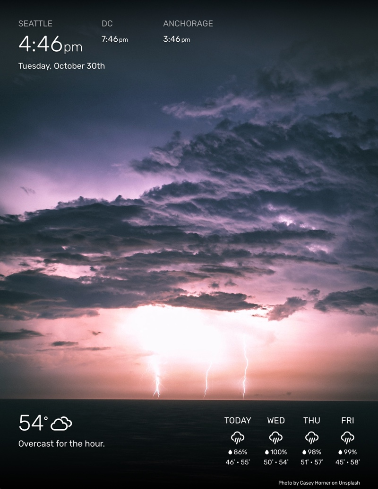
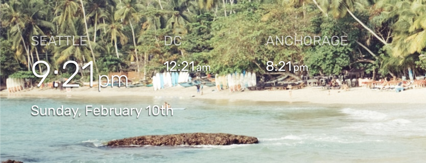
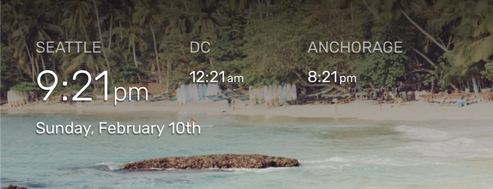
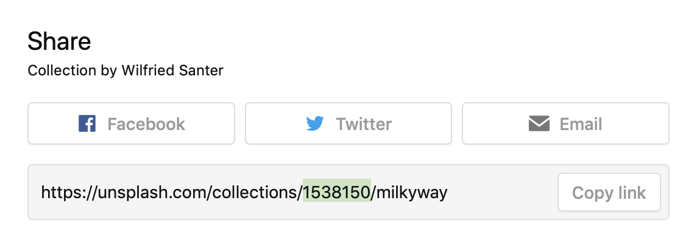

# WallberryTheme: A MagicMirror² Module
The `WallberryTheme` module re-themes [MagicMirror²](https://github.com/MichMich/MagicMirror) to look like a beautiful photo-box wall display. It adds a new font, styles, and periodically changing background image pulled from Unsplash.com.

The WallberryTheme also comes packaged with two companion modules for displaying the time (`WB-clock`) and weather (`WB-weather`).

 **REQUIRED API KEYS:**

- A (free) Unsplash API key is required and can be obtained from [Unsplash.com](https://unsplash.com/developers).
- For the weather module, a (free) OpenWeatherMap API key is required and can be obtained at [OpenWeatherMap.org/api](https://openweathermap.org/api).

## New and Shiny in 3.0.0

The [WB-weather](WB-weather/README.md) companion module has now been completely refactored with some great new features:

- **OpenWeatherMap is now the default weather provider** (RIP DarkSky, you were taken too soon).
- WB-weather **still supports DarkSky** as a provider for existing users with API keys, but expect the API to be shuttered officially by Apple by end of 2021.
- New weather providers can be easily integrated by subclassing WB-weather's new `WBProvider` class.
- New config option for choosing which display template to use, so you can easily change how the weather is displayed by adding new templates.


 Go check out the details in [WB-weather's README](WB-weather/README.md).

## Screenshots
<p align="center">


</p>

## Now With More Options For Bright Images!

WallberryTheme has new options for dealing with light text on bright background images!

- The `addBackgroundFade` option allows you to add soft gradient backgrounds to the top and bottom regions of your magic mirror, providing more contrast for the modules in those regions. These gradients use Unsplash's color data to automatically shift to the general color hue of the photo, so they blend better with the image.

- The `autoDimOn` feature auto-detects bright images and automatically dims them, ensuring bright images don't wash out your text and dark images remain vibrant.

**No background fade, auto dim set to off:**


**With addBackgroundFade and autoDimOn (on their default settings):**


## Using the module

To use this module and its companion modules:
1.  Copy the `WallberryTheme` folder to your `MagicMirror/modules` directory
2.  Add the modules to the modules array in the `config/config.js` file like in the following example:

````javascript
modules: [
  // Base WallberryTheme adds new font, styles, and a rotating background image pulled from Unsplash.com
  {
    module: "WallberryTheme",
    position: "fullscreen_below", // Required Position
    config: {
      unsplashAccessKey: "Your Unsplash API Key", // REQUIRED
      collections: "2589108" // optional - leave empty for a random photo
    }
  },
  // WB-clock adds local time (Optional Module)
  {
    module: "WallberryTheme/WB-clock",
    position: "top_bar", // highly suggest using top_bar position
    config: {
      localCityName: "Seattle", // optional
      otherCities: [
      	{name: "DC", timezone: "US/Eastern"}, // optional
      	{name: "Anchorage", timezone: "US/Alaska"} // optional
      ]
    }
  },
  // WB-weather adds weather (Optional Module)
  {
    module: "WallberryTheme/WB-weather",
    position: "bottom_bar",  // Highly suggested location
    config: {
      // See "Configuration options" for more information.
      apiKey: "Your openweathermap API key", // REQUIRED
      latitude:   47.603230, // REQUIRED
      longitude: -122.330276 // REQUIRED
    }
  }
]
````

## Configuration options

The following properties of `WallberryTheme` can be configured. For more information on how to configure the [WB-clock](WB-clock/README.md) and [WB-weather](WB-weather/README.md) modules see their individual README files.


| Option                      | Type    | Description
| ----------------------------|---------| ----------------
| `unsplashAccessKey`         | String  | Your Unsplash API access key. Sign up for free at [https://unsplash.com/developers](https://unsplash.com/developers). Demo accounts are allowed `50 API requests per hour`. <br><br>  This value is **REQUIRED**
| `collections`               | String  | A comma-separated list of Unsplash collection IDs that photos should be pulled from. Collection IDs can be found in the URL of the collection, shown in the highlighted part of this screenshot:   <br><br> **Example:** `"1538150,162213"` <br> **Default value:** `""` (no collection, theme will use a random Unsplash photo)
| `queries`                   | Array   | A list of queries to search for on Unsplash. When multiple queries are specified, one gets randomly picked every refresh. <br><br> **Example:** `["cars", "new york", "black cat"]` <br> **Default value:** `[]`
| `updateInterval`            | Number  | How often the photo should change (Milliseconds). <br><br> **Default value:** `300000` (5 minutes)
| `orientation`               | String  | What screen orientation photos should be optimized for. <br><br> **Possible values:** `"portrait"`, `"landscape"`, or `"squarish"` <br> **Default value:** `"portrait"`
| `backgroundOpacity`         | Number  | Controls the darkness of the background photo. <br><br> **Possible values:** Any number from `0.0` (black screen) to `1` (fully bright image)<br> **E.G.**: `0.5` would be the background at half brightness<br> **Default value:** `1`
| `brightImageOpacity`        | Number  | Controls the darkness of bright photos (determined by `autoDimOn`). Only used when `autoDimOn` is `true`. <br><br> **Possible values:** Any number from `0.0` (black screen) to `1` (fully bright image)<br> **Default value:** `0.85`
| `autoDimOn`                 | Boolean | Automatically darkens bright photos to the value set by `brightImageOpacity`. <br><br> **Possible values:** `true` (on) or `false` (off) <br>**Default value:** `true`
| `addBackgroundFade`         | Array   | Adds darker gradient backgrounds to the top bar region and/or bottom bar regions of MagicMirror (helps with readability for bright or busy background images). <br><br> **Possible values:** `"top"` will add a gradient background to the top bar region, `"bottom"` will add a gradient background to the bottom bar region. Set to an empty list to remove all gradients.  <br>**Default value:** `["top", "bottom"]`
| `clearCacheOnStart`         | Boolean | Clears Electron's cache on MagicMirror startup, preventing an issue where Electron would sometimes encounter a CORS error when trying to load a previously cached background image ([see this issue here for details](https://github.com/delightedCrow/WallberryTheme/issues/8)).  <br><br> **Possible values:** `true` (on) or `false` (off) <br>**Default value:** `true`
| `imageHeight`               | String or Number  | Use "auto" to use your screen's height, or specify a hardcoded width in pixels. <br><br> **Default value:** `"auto"`
| `imageWidth`                | String or Number  | Use "auto" to use your screen's width, or specify a hardcoded width in pixels. <br><br> **Default value:** `"auto"`
| `imageOptions`              | String  | See [Unsplash documentation](https://unsplash.com/documentation#dynamically-resizable-images) for supported parameters. <br><br> **Default value:** `"fit=crop"`

## Contributing

Contributions of all kinds (pull requests, bug reports, feature suggestions, documentation, etc) are all welcome and encouraged.

If you're enjoying the WallberryTheme and wanna make my day:

* **:coffee: [Buy me a coffee](https://ko-fi.com/delightedcrow) :coffee:** and fuel my motivation for open source development ;)
* Post a screenshot of your MagicMirror running WallberryTheme in the [GitHub discussion](https://github.com/delightedCrow/WallberryTheme/discussions/categories/show-and-tell).

Huge thanks to everyone who has contributed and made the WallberryTheme better!

### Guidelines for Pull Requests
- **Pull Requests should be submitted to the `dev` branch**
- If there isn't one already, it's helpful to open an issue detailing the feature/bug your PR will address before you submit it.
- Add a short description of your change to the [Changelog file](CHANGELOG.md) file under the `[Unreleased]` section.

## Attributions & Special Thanks

- Thanks to the magnificent MagicMirror² community, y'all are creative and awesome <3
- The light/dark detection functionality in [colorHelpers.js](colorHelpers.js) was taken from this wonderful [StackOverflow answer by ToniTornado](https://stackoverflow.com/questions/13762864/image-dark-light-detection-client-sided-script), and you can check out the [jsFiddle for it here](http://jsfiddle.net/s7Wx2/).
- The color conversion functions in [colorHelpers.js](colorHelpers.js) were taken from the [colorsys](https://github.com/netbeast/colorsys) library by netbeast, and they saved me a great deal of time <3.

## Changelog

Visit the [Changelog file](CHANGELOG.md) to see the latest changes to the project :)
