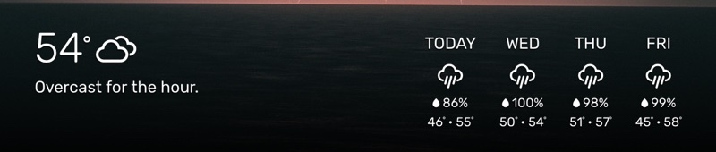

# Module: WB-weather
The `WB-weather` module was designed to complement the `WallberryTheme` module and displays the current weather and forecast. It uses [OpenWeatherMap](https://openweathermap.org/) as its default weather provider, but it can be easily configured to use other weather providers instead.

## Using the module

To use this module, add it to the modules array in the `config/config.js` file:
````javascript
modules: [
	{
		module: "WallberryTheme/WB-weather",
		position: "bottom_bar",  // Highly suggested location
		config: {
			// See "Configuration options" for more information.
			apiKey: "add your OpenWeatherMap API KEY here",
			latitude:   47.603230,
			longitude: -122.330276
		}
	}
]
````

## General Configuration Options

These general options should honored the same across all weather providers. Specific weather providers may provide further options.

| Option                      | Default            | Type       | Description
| ----------------------------|--------------------| -----------|------------
| `apiKey` <br>**REQUIRED**   | None               |String      | The API key for your weather provider.
| `latitude` <br>**REQUIRED** | None               |Number      | Your current latitude.
| `longitude` <br>**REQUIRED**| None               |Number      | Your current longitude.
| providerName                | "openweathermap"   |String      | The name of your weather provider (See available weather providers below).
| template                    | "classic-wallberry"|String      | The name of your weather template. (See available templates below).
| `units`                     | config.units       |String      | What temperature units to use. **Possible values:** `"imperial"`, `"metric"`, `"standard"`<br>
| `language`                  | config.language    |String      | What language to use. <br><br> **Possible values:** `en`, `nl`, `ru`, etc...<br>
| `daysToForecast`            | 4                  |Number      | How many days to forecast in weekly forecast. <br><br> **Possible values:** Varies by provider. <br>
| `updateInterval`            | `600000` (10 minutes)|Number    | How often to fetch new weather data (Milliseconds). Limits vary by provider.

-------------------------------

## Available Weather Providers

### OpenWeatherMap

OpenWeatherMap is currently the default weather provider for WB-weather.

 * **Sign up for a free API key at [https://openweathermap.org/api](https://openweathermap.org/api)**.
 * Free accounts are limited to 60 API calls/minute.
 * **Minimum limit for updateInterval:** 10 minutes ([OpenWeatherMap suggests a limit](https://openweathermap.org/appid) of 1 API call every 10 minutes because their weather servers do not update weather any faster than that.)
 * **Maximum number of forecast days:** 8 days.

#### OpenWeatherMap Configuration Options

| Option                      | Default            | Type       | Description
| ----------------------------|--------------------| -----------|------------
| `apiKey` <br>**REQUIRED**   | None               |String      | Your OpenWeatherMap API Key.
| `latitude` <br>**REQUIRED** | None               |Number      | Your current latitude.
| `longitude` <br>**REQUIRED**| None               |Number      | Your current longitude.
| providerName                | "openweathermap"   |String      | The providerName for OpenWeatherMap.

#### Sample WB-weather config Using OpenWeatherMap

````javascript
modules: [
	{
		module: "WallberryTheme/WB-weather",
		position: "bottom_bar",  // Highly suggested location
		config: {
			// See "Configuration options" for more information.
			apiKey: "add your OpenWeatherMap API KEY here",
			providerName: "openweathermap",
			latitude:   47.603230,
			longitude: -122.330276
		}
	}
]
````
-------------------------------

### DarkSky

The original weather provider for the WallberryTheme.

 * [DarkSky was acquired by Apple](https://blog.darksky.net/) and **no longer allows sign ups for new API keys** :(
 * Support for users who already have API keys will continue through the **end of 2021**
 * Free accounts are limited to 1,000 API calls each day
 * **Minimum limit for updateInterval:** 10 minutes.
 * **Maximum number of forecast days:** 8 days.

#### DarkSky Configuration Options

| Option                      | Default            | Type       | Description
| ----------------------------|--------------------| -----------|------------
| `apiKey` <br>**REQUIRED**   | None               |String      | Your DarkSky API Key.
| `latitude` <br>**REQUIRED** | None               |Number      | Your current latitude.
| `longitude` <br>**REQUIRED**| None               |Number      | Your current longitude.
| providerName<br>**REQUIRED**| "darksky"          |String      | The providerName for DarkSky.

#### Sample WB-weather config Using DarkSky

````javascript
modules: [
	{
		module: "WallberryTheme/WB-weather",
		position: "bottom_bar",  // Highly suggested location
		config: {
			// See "Configuration options" for more information.
			apiKey: "add your darkSky API KEY here",
			providerName: "darksky",
			latitude:   47.603230,
			longitude: -122.330276
		}
	}
]
````

-------------------------------

## Available Display Templates

### Classic Wallberry

The current default template for WB-weather. Displays the current weather and upcoming forecast.

* **Template Name:** `"classic-wallberry"`
* **Providers Supported:** OpenWeatherMap, DarkSky

Sample Screenshot:



-------------------------------

# WB-weather Development

**Pull Requests for adding new providers and templates to WB-weather are very welcome!**

**BEFORE** you submit your pull request:

- Please read [The Contributing Section of the WallberryTheme README](../README.md#Contributing).
- **If you add a Template**: include a section for your template under the  `Available Display Templates` header in this README with the appropriate documentation (see the classic-wallberry template above for an example). **Make sure you include a sample screenshot of your template.**
- **If you add a Weather Provider**: include a section for your provider under the `Available Weather Providers` header in this README with appropriate documentation (see the openweathermap provider for above for an example).

-------------------------------

## Writing A New Weather Provider

All weather providers are located in the `WB-weather/providers/` directory and should subclass either the [`WBProvider` or the `WBProviderWithHelper` class](WB-provider.js).

### Examples

* [WB-openweathermap.js](providers/WB-openweathermap.js) subclasses `WBProvider` and implements the OpenWeatherMap API.
* [WB-darksky.js](providers/WB-darksky.js)/[WB-darksky-helper.js](providers/WB-darksky-helper.js) subclasses `WBProviderWithHelper` and implements the DarkSky API.

### Provider Naming Conventions

- Choose a short name for your provider, such as `myprovider`, that users will use in the `providerName` option in their module config file.
- **Make sure your providerName is LOWER CASE.**
- Name your provider's javascript file `WB-{myprovider}.js`, with `{myprovider}` being your `providerName`.
- If you're implementing `WBProviderWithHelper`, the .js file for your helper function should be named `WB-{myprovider}-helper.js`.

### Implementing WBProvider

Subclassing `WBProvider` is the simplest way to add a new weather provider.

* **Don't forget** to register your provider class with `WBProviderManager` at the end of your file!


````javascript
class WBMyProvider extends WBProvider {
	constructor(config, delegate) {
		super(config, delegate);
		// your init here
	}

	get updateIntervalLimit() {
		// implement
	}

	get daysToForecastLimit() {
		// implement
	}

	fetchWeather() {
		// implement
	}

// VERY IMPORTANT, WB-weather won't find you otherwise!
WBProviderManager.register("myprovider", WBMyProvider);

````

### Configuration Options

The configuration options chosen by the user will be passed to your constructor via the `config` variable.

* Your provider should support all of the general options listed in the `General Configuration Options` section at the top of this README.
* You are welcome to add more config options specific to your provider (just make sure you document them for your users!).

### Required Functions

For your provider to work, `WBProvider` requires you to implement the following functions in your subclass (and will throw errors if you don't):

#### updateIntervalLimit

Most APIs have limits on how often users should call their APIs. Setting this explicitly is important to stop users from (usually accidentally) setting a refresh rate that will quickly run them out of their API call budget.

**Consult your weather API documentation** for limits on how often your provider should call the API and set a reasonable limit here.

````javascript
get updateIntervalLimit() {
	return 10 * 60 * 1000; // 10 minutes
}

````

#### daysToForecastLimit

Most weather providers will only supply forecasts up to so many days. Set the maximum here.

**Consult your weather API documentation** for the maximum number of days of forecast data it can provide.

````javascript
get daysToForecastLimit() {
	return 8;
}

````

#### fetchWeather()

The function where the magic happens. Here you will:

* Do your network call(s) to get data from your weather API
* Handle any errors that happen during your fetch
* On a successful fetch, process your weather data into a `WBWeather Object`, which will be handed off to a template for display.

`WBProvider` has three special `resolve` functions to make these things easy. See the example code below:

````javascript
fetchWeather() {
	// get your data from your weather API
	var apiData = mySpecialAPICall();

	// handle errors
	if (networkError)
		// if you get a temprary error, such as a network error,
		// use this resolve function to tell WB-weather to try
		// fetching the weather again after a delay
		this.resolveWithTemporaryError("Oh no the internet is down.");

	if (serverError)
		// if you get a critical error that requires the user to
		// intervene, use this resolve function to alert the user and
		// stop WB-weather from making further API calls
		this.resolveWithCriticalError("Server says: INVALID API KEY.");

	// if successful, process your weather data into a WBWeather object
	var weather = new WBWeather();
	weather.temp = apiData.currentTemperature;
	//etc etc...

	// Hand off your weather object when you're done
	this.resolveWithSuccess(weather);
}
````

#### Data Model

The data classes in `Wb-DataObjects.js`, specifically `WBWeather` and `WBForecast`, help standardize the weather data that is generated by the providers and then passed to the templates for display.

* Your provider should attempt to fill in as much data as it can for the documented properties of these objects. **The more data you fill in, the more likely it is for your provider to work with multiple display templates.**
* Your provider can add custom properties to these objects, but remember that it's up to the templates to support them.


### Implementing WBProviderWithHelper

`WBProviderWithHelper` is a subclass of `WBProvider`, but it allows you to perform your API call from MagicMirror's node.js server using its node_helper function. This is helpful if your weather service has CORS configured to require requests to come from a server instead of a browser (like DarkSky does), or you just want to use the features of node.js.

You'll implement `WBProviderWithHelper` almost exactly as you would `WBProvider`, but in place of `fetchWeather()` you'll need to implement `dataForHelper()` and `helperResponse()` instead:

````javascript
class WBMyProvider extends WBProviderWithHelper {
	constructor(config, delegate) {
		super(config, delegate);
		// your init here
	}

	get updateIntervalLimit() {
		// implement
	}

	get daysToForecastLimit() {
		// implement
	}

	dataForHelper() {
		// prepare whatever data your helper will need
		return {};
	}

	helperResponse(data) {
		// data contains the results of your fetch function
		// process this data as you would in WBProvider's fetchWeather()
		var weather = new WBWeather();
		weather.temp = data.currentTemperature;
		//etc etc...

		// Hand off your weather object when you're done
		this.resolveWithSuccess(weather);
	}

// VERY IMPORTANT, WB-weather won't find you otherwise!
WBProviderManager.register("myprovider", WBMyProvider);

````

#### The Helper file

You'll also need to write a helper file for the node_helper.js to call. This file should export a function that returns a promise, the results of which will be handed back to your provider in your `helperResponse()` function.

For example:


````javascript
//helper code should be in your WB-myProvider-helper.js file

const fetch = require("node-fetch");
// the data argument passed here will be from your dataForHelper() function
module.exports = function(data) {
	// the results of this promise will be passed
	// to your helperResponse() function
	return fetch(config.url)
		.then(res => res.json())
		.catch(error => {
			return {network_error: error};
		});
};
````

-------------------------------

### Writing A New Display Template

All templates are .njk files and should be located in the `WB-weather/templates` directory.

#### Examples

See the [classic-wallberry.njk](templates/classic-wallberry.njk) template as an example.

#### Data Sources

Templates can expect to have two named variables exposed to them by WB-weather:

- **`weather`** - this object holds all the weather data
	- if there is no weather data, value will be `null`
	- if there is data, value be a [`WBWeather` object](WB-dataObjects.js) populated with weather data by a weather provider.
- **`error`** - this object holds error data if there was a problem fetching the weather
	- if there were no errors, value will be `null`
	- if there are errors, value will be a [`WBError` object](WB-dataObjects.js) populated with error data

#### Template Naming Conventions

 * Choose a short, unique name for your template, such as `mytemplate`, that users will use in the `template` option in their module config file.
 * **Make sure your template name is all LOWER CASE.**
 * Use the same name for your template's .njk file, (e.g. `mytemplate.njk`).
 * If you have CSS to go along with your template, add a css file in `WB-weather/css` with the same name as your template (e.g. `mytemplate.css`).
